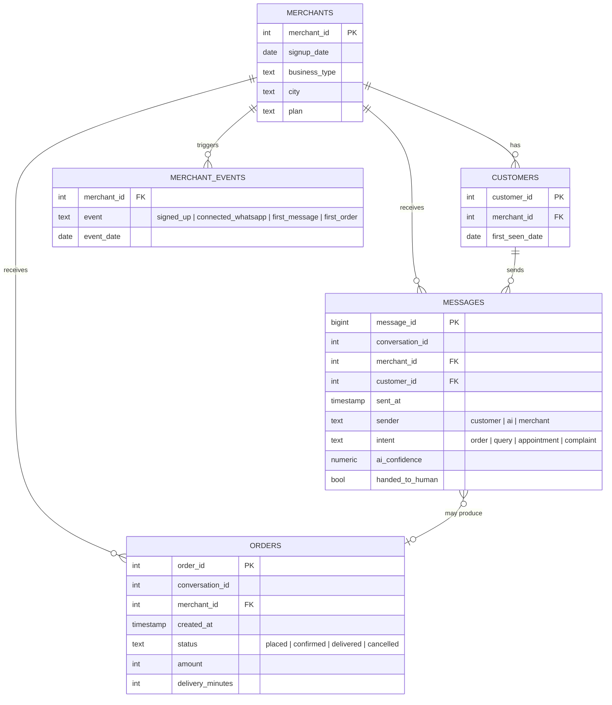

# WhatsApp Commerce Analytics

A portfolio analytics project modeling the kind of data a WhatsApp-first SMB
commerce platform would generate: merchant onboarding, AI-agent conversations,
and order fulfillment. Built with **PostgreSQL, Python, and Streamlit** to
practice the SQL, cohort/retention analysis, and dashboarding skills used in
operational and conversational analytics roles.

> **⚠️ All data in this project is synthetic.** It was generated by
> `generate_data.py` to follow realistic patterns (see *Key Findings* below),
> but no real merchants, customers, or orders are represented. Numbers are
> illustrative, not real business results.

**[Live dashboard →](#)** *(add your deployed Streamlit link here)*

---

## Why this project

Operational data from a conversational commerce platform looks very
different from a typical e-commerce dataset: the "funnel" runs through chat
messages before it ever reaches an order, an AI agent is making real-time
decisions inside that funnel, and response latency itself affects whether a
sale completes. This project simulates that shape of data and analyzes it
the way I would on the job — SQL-first, with a dashboard a founder or ops
lead could actually use.

## Tech stack

| Layer | Tool |
|---|---|
| Data generation | Python (NumPy, Pandas) |
| Database | PostgreSQL |
| Analysis | SQL (joins, CTEs, window functions, `FILTER`, `PERCENTILE_CONT`) |
| Dashboard | Streamlit, Plotly, SQLAlchemy |

## Project structure

```
whatsapp-commerce-analytics/
├── generate_data.py          # synthetic data generator
├── data/                     # generated CSVs (gitignored — regenerate locally)
├── sql/
│   ├── 01_schema.sql         # table definitions, constraints, indexes
│   ├── 02_load.sql           # \copy CSVs into Postgres
│   ├── 03_validate.sql       # data-quality checks (all should return 0)
│   ├── 04_funnel.sql         # activation funnel
│   ├── 05_cohort_retention.sql  # weekly cohort retention
│   ├── 06_ai_performance.sql    # AI confidence, response time, hand-off rate
│   ├── 07_fulfillment.sql       # order status, cancellation vs. wait time
│   └── 08_churn.sql             # churn flag, churn by segment, at-risk merchants
├── app/
│   ├── app.py                 # Streamlit dashboard
│   ├── requirements.txt
│   └── .streamlit/secrets.toml.example
└── README.md
```

## Data model

Five tables, generated together so every foreign key resolves and the
funnel/retention/cancellation patterns below are consistent across tables.



## Setup

```bash
# 1. Generate the synthetic data
pip install numpy pandas
python generate_data.py                 # writes data/*.csv

# 2. Load it into PostgreSQL
createdb ordflo_analytics
psql -d ordflo_analytics -f sql/01_schema.sql
psql -d ordflo_analytics -f sql/02_load.sql
psql -d ordflo_analytics -f sql/03_validate.sql   # every check should read 0

# 3. Run the dashboard
cd app
pip install -r requirements.txt
streamlit run app.py
```

By default the app connects to `postgresql+psycopg2:///ordflo_analytics`
(local socket auth). If your Postgres needs a password, or you're deploying
to Streamlit Community Cloud against a hosted database (e.g. a free
[Neon](https://neon.tech) or [Supabase](https://supabase.com) instance), copy
`app/.streamlit/secrets.toml.example` to `secrets.toml` and set
`DATABASE_URL` there.

## Key findings

*(All figures are from the default synthetic run — 600 merchants, seed 42.
They will vary slightly with a different seed or merchant count.)*

- **Activation funnel:** 100% of signups connect WhatsApp at 91.5%, send a
  first message at 83.5%, but only 58.5% ever place a first order — the
  biggest drop-off is between "connected" and "ordering," not signup itself.
- **Speed-to-first-order predicts retention:** merchants who placed their
  first order within 3 days of signup had **77.5%** 60-day retention, versus
  **41.5%** for those who took longer. This is the strongest lever in the
  dataset — it suggests onboarding should be optimized to get a merchant's
  *first* order placed fast, not just to get them connected.
- **AI performance varies sharply by intent:** average AI confidence is
  0.87 on order-intent messages but only 0.63 on complaints, and complaints
  are escalated to a human **28.3%** of the time versus under 6% for every
  other intent — exactly where you'd want better training data or tighter
  human-in-the-loop review.
- **Slow responses cost orders:** cancellation rate rises from **7.4%** when
  the slowest reply in a chat is under 30 seconds to **30.9%** when it's
  10–60 minutes. Response latency isn't just a UX metric — it shows up
  directly in lost revenue.
- **Churn is concentrated:** free-plan restaurant and clothing merchants
  churn at 72–84%, while paid-plan pharmacy merchants churn at under 18%.
  Plan tier and business type together are strong churn predictors.

## SQL techniques used

Multi-table joins and subqueries · CTEs · window functions (`LAG`,
`FIRST_VALUE`, `ROW_NUMBER`) · `FILTER` clauses for conditional
aggregation · `PERCENTILE_CONT` for medians/percentiles · `DATE_TRUNC` for
weekly/monthly bucketing · derived metrics (response time, retention,
churn) computed from raw timestamps rather than stored directly.

## Known limitations

- The dashboard's `SNAPSHOT` date is hardcoded to match the synthetic
  dataset's fixed "today." On live, growing data this would be replaced
  with `CURRENT_DATE`.
- Early signup-week cohorts are small (a handful of merchants), so their
  retention percentages are noisy. Later cohorts (20+ merchants) are more
  stable. Regenerate with `--merchants 1200` for smoother early cohorts if
  needed.
- All data is synthetic — the *patterns* are realistic by design, but the
  specific percentages aren't drawn from any real business.

## Author

Rohit Kumar Yadav — [GitHub](#) · [LinkedIn](#)
